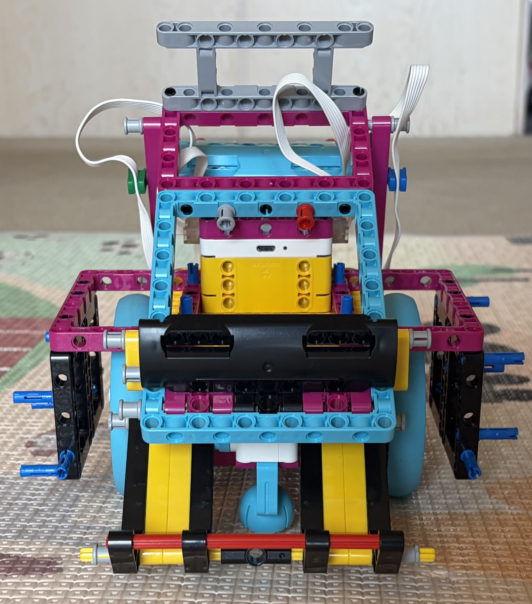
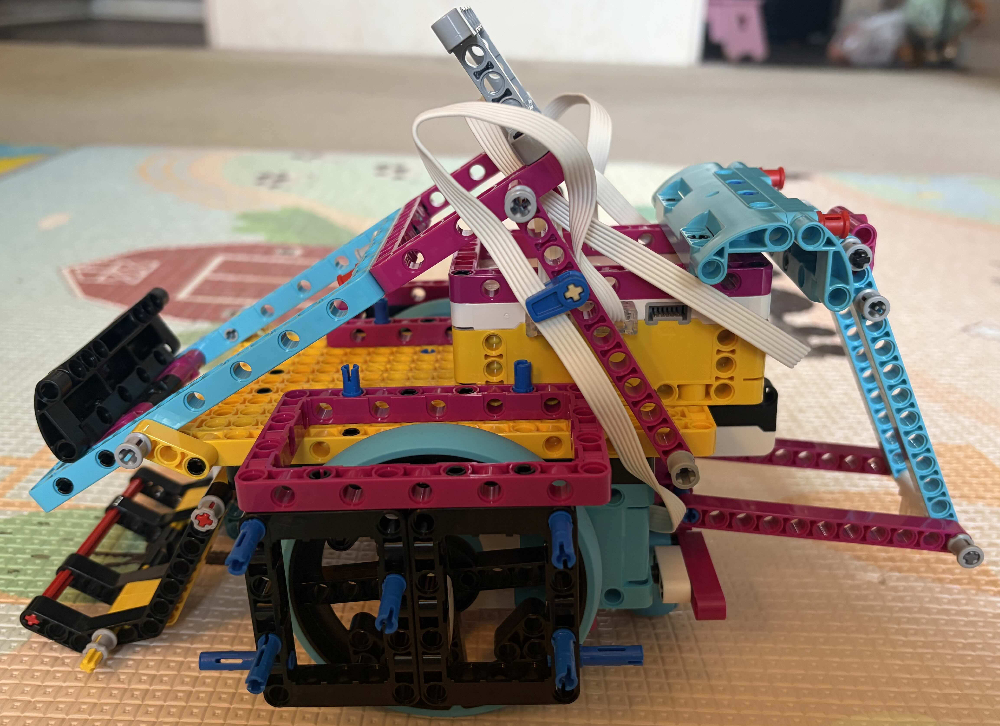
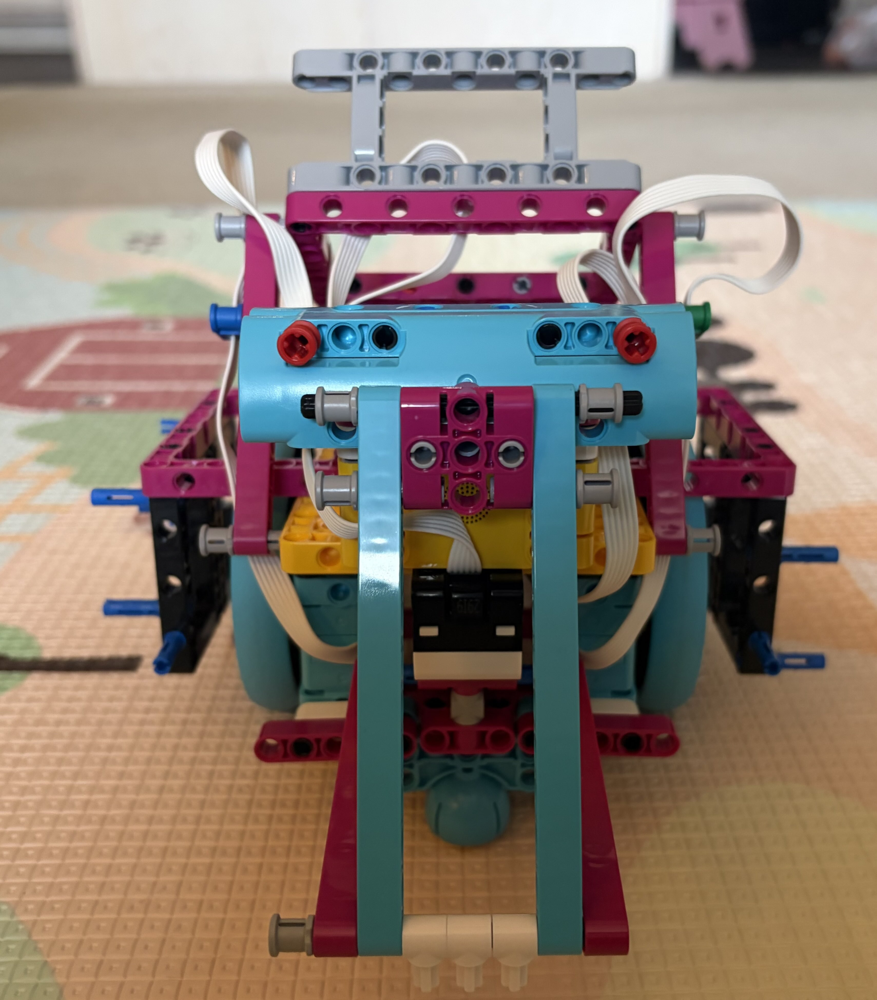
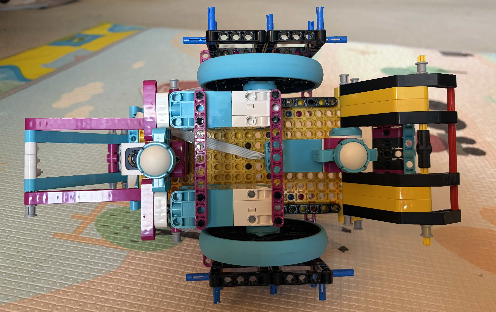
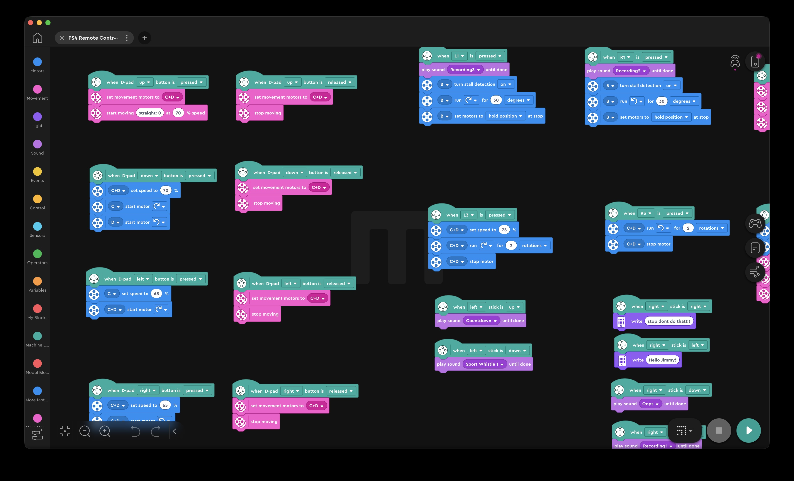

# What

This is a Lego Spike prime sumobot project. It is crteated by 10-year old Jimmy in Dec 2025.

# How

## Step 1 Building Instrustion
I show you the picture of my sumobot. This is how it is built.

Front View

Left View

Back View

Bottom View

## Step 2 Programming the Hub

Behind the scene, my dad downgraded the hub to Spike Prime legacy firmware so that I can program it in the Mindstorm app.

This is the first iteration sumobot. It is manually controlled by my PS4 controller. You can download [the program here.](PS4-Remote-Control-Sumobot.lms)
